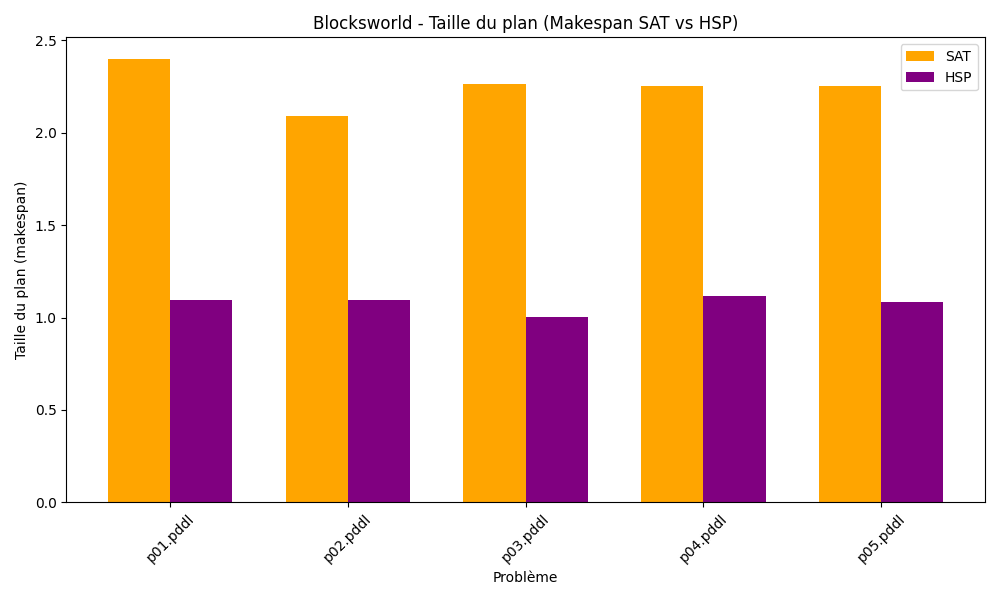
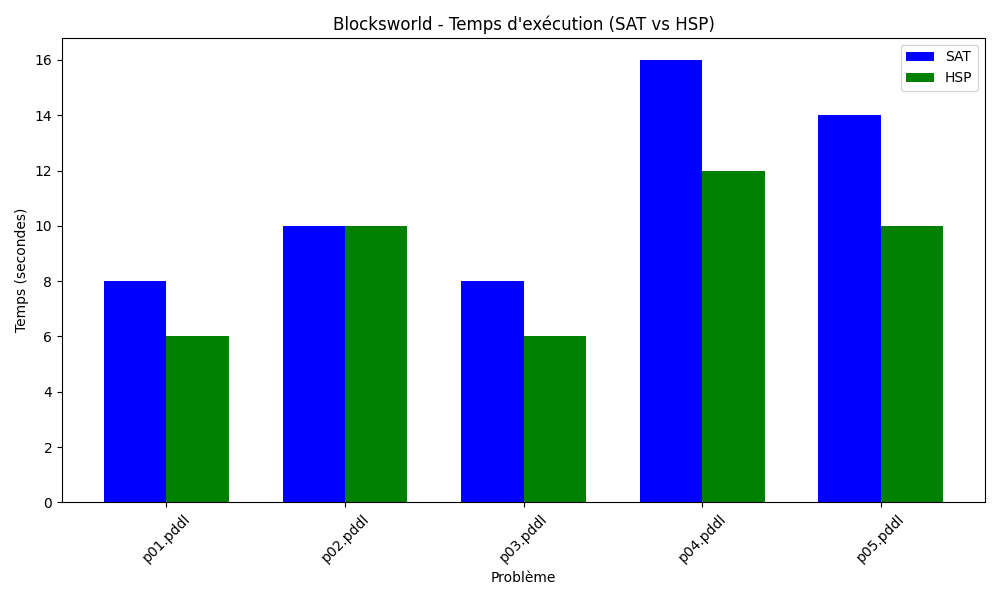
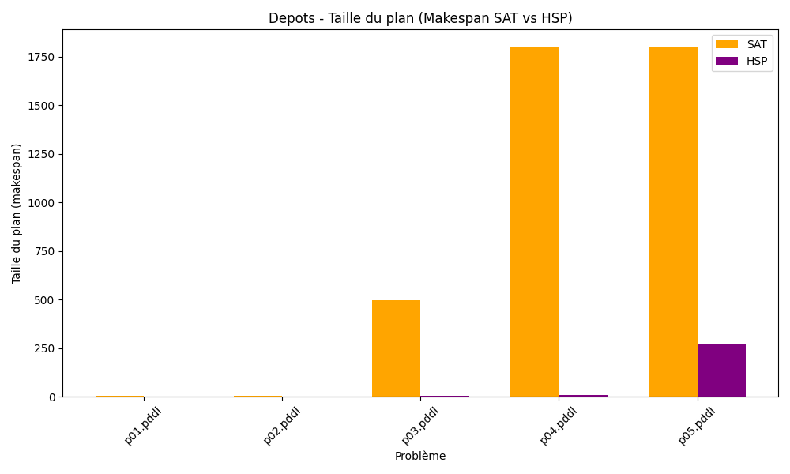
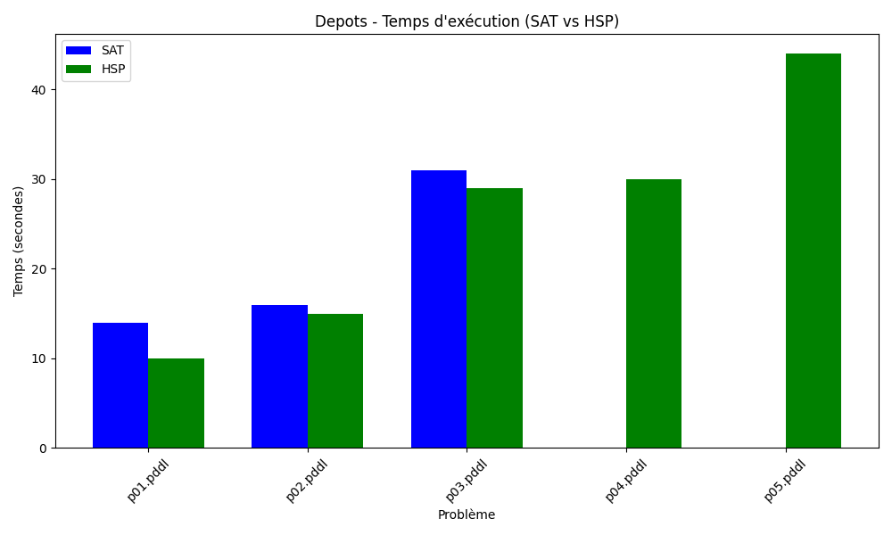
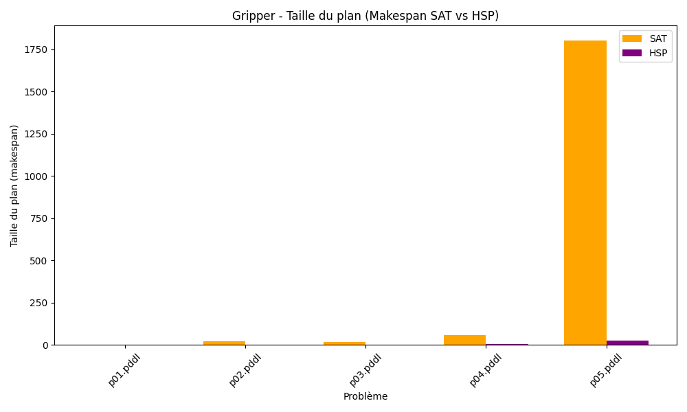
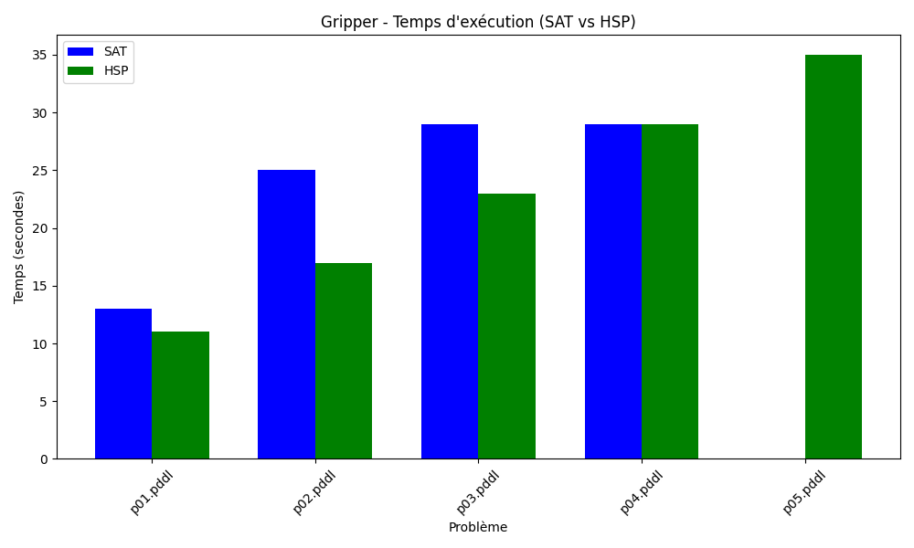
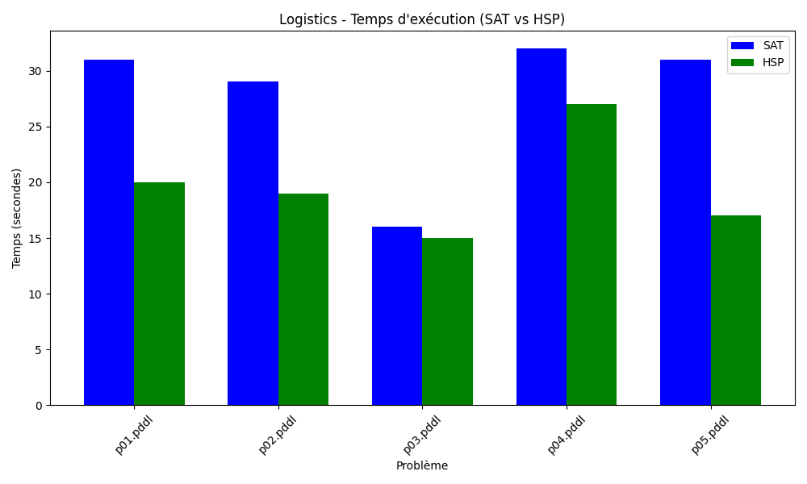

# SAT Planner with PDDL4J and SAT4J

## Overview

This project implements a **SAT-based planner** using the [PDDL4J 4.0.0](http://pddl4j.imag.fr/) library. It encodes a PDDL planning problem into a SAT formula and solves it using the [SAT4J](https://www.sat4j.org) solver. The resulting plan is exported and validated using [VAL](https://github.com/KCL-Planning/VAL).

It also includes a benchmark and comparison framework against the classical **HSP (A*) planner*\* from PDDL4J on four domains: `blocksworld`, `depots`, `gripper`, and `logistics`, using two metrics: **runtime** and **plan length (makespan)**.

---


## How to Run

### 1. ⚒ Compile the SAT Planner

Use Maven to build and run:

```bash
mvn compile
mvn exec:java -Dexec.mainClass=com.mycompany.sat_planner.SAT_Planner -Dexec.args="pddl/domain.pddl pddl/problem.pddl -o plan.txt -s 5"
```

### 2. Compare SAT vs HSP

```bash
python comparison.py
```

This generates `comparison_results.csv` with runtime and makespan values.

### 3.  Generate Charts

```bash
python plot_result.py
```

This produces 8 figures:

* 4 runtime comparisons (`*_time_comparison.png`)
* 4 makespan comparisons (`*_makespan_comparison.png`)


## Figures










## References

* Ghallab, Nau, Traverso, "Automated Planning: Theory and Practice" — Chapter 7
* [PDDL4J Documentation](http://pddl4j.imag.fr/)
* [SAT4J Solver](https://www.sat4j.org)
* [VAL Plan Validator](https://github.com/KCL-Planning/VAL)
